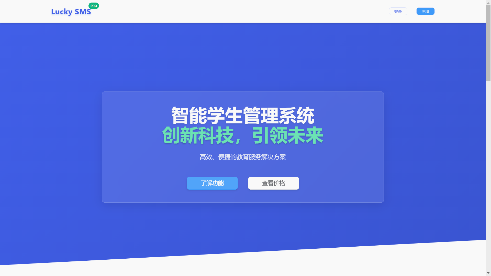

<div align="center">
  <h1>Lucky_SMSS - 现代化学生信息管理系统</h1>
  
  <p>
    <em>基于 Vue 3 + Spring Boot 3 构建的全栈式教育管理解决方案</em>
  </p>

  <div>
    <a href="https://github.com/YangShengzhou03/Lucky_SMSS/stargazers">
      
    </a>
    <a href="https://github.com/YangShengzhou03/Lucky_SMSS/forks">
      
    </a>
    <a href="https://opensource.org/licenses/MIT">
      
    </a>
    <a href="https://github.com/YangShengzhou03/Lucky_SMSS/issues">
      
    </a>
    <a href="https://github.com/YangShengzhou03/Lucky_SMSS/pulls">
      
    </a>
  </div>

  <div>
    <a href="https://spring.io/projects/spring-boot">
      
    </a>
    <a href="https://v3.vuejs.org/">
      
    </a>
    <a href="https://www.mysql.com/">
      
    </a>
    <a href="https://redis.io/">
      
    </a>
  </div>

  <br />
  
  [](https://star-history.com/#YangShengzhou03/Lucky_SMSS&Date)

</div>

## 目录
1. [项目概述](#项目概述)
2. [技术架构](#技术架构)
3. [核心功能](#核心功能)
4. [系统截图](#系统截图)
5. [安装部署](#安装部署)
6. [使用说明](#使用说明)
7. [目录结构](#目录结构)
8. [参与贡献](#参与贡献)
9. [常见问题](#常见问题)
10. [联系我们](#联系我们)
11. [开源许可](#开源许可)

## 项目概述
Lucky_SMSS 是一款基于 **Vue 3** 和 **Spring Boot 3** 构建的**开源学生信息管理系统**，专为教育机构打造。系统采用**前后端分离架构**，支持**多角色权限管理**（管理员、教师、学生），提供一站式教育管理解决方案。

**适用场景**
- 毕业设计与课程作业
- 中小学及高校信息化系统
- 培训机构管理平台
- 商业项目开发基础框架

## 技术架构

### 前端技术栈
| 技术                | 描述                                                         |
|---------------------|--------------------------------------------------------------|
| **Vue 3**           | 渐进式 JavaScript 框架，用于构建用户界面                     |
| **Vue Router**      | Vue.js 官方路由管理器，实现页面跳转与路由控制                 |
| **Element Plus**    | 基于 Vue 3 的组件库，提供丰富的 UI 组件，加速界面开发         |
| **Vue CLI**         | Vue.js 开发的标准工具，提供项目脚手架和开发服务器           |
| **Axios**           | 基于 Promise 的 HTTP 客户端，用于浏览器和 Node.js 中的数据交互 |
| **Chart.js**        | 简单灵活的 JavaScript 图表库，用于数据可视化展示             |
| **ECharts**         | 强大的数据可视化库，支持各种复杂的图表和地图展示             |

### 后端技术栈
| 技术                | 描述                                                         |
|---------------------|--------------------------------------------------------------|
| **Spring Boot 3.4.5**   | 简化 Spring 应用开发的框架，提供自动配置和快速开发的能力     |
| **MyBatis-Plus 3.5.6**    | 简化 MyBatis 开发的增强工具，提供 CRUD 操作和代码生成功能      |
| **JWT**             | JSON Web Token，用于在网络应用间安全传递声明，支持无状态认证  |
| **MySQL 8.0.33**        | 高性能关系型数据库，存储系统核心业务数据                      |
| **Redis**           | 内存数据存储，用于缓存高频访问数据，提升系统响应速度          |
| **RocketMQ**        | 分布式消息队列，用于异步处理和系统解耦                        |
| **Spring Security** | 提供强大的身份验证和授权功能，保障系统安全访问                |

## 核心功能

### **管理员功能**
- 用户管理：全量管理系统用户（创建、编辑、删除、状态控制）
- 角色权限配置：自定义角色并分配精细化权限，支持权限粒度控制
- 系统设置：配置学校基础信息、学期管理、数据字典维护等
- 数据统计分析：多维度展示系统使用情况、学生数据统计与可视化报表
- 图书管理：管理图书馆藏书信息、借阅记录和库存状态

### **教师功能**
- 课程管理：创建、编辑、下架课程信息，维护课程大纲与教学计划
- 成绩录入：支持批量导入和单个录入学生成绩，支持成绩修改与审核
- 考勤管理：记录学生出勤情况（正常、迟到、早退、缺勤），生成考勤报表
- 教学资源管理：上传、分类、分享教学资料（课件、视频、习题等）

### **学生功能**
- 个人信息管理：查看和修改个人基本信息，支持头像上传与资料完善
- 课程查询：浏览课程列表、查看课程详情，支持按条件筛选感兴趣的课程
- 成绩查询：查看个人各科成绩、平均分及排名，支持成绩趋势分析
- 考勤查询：查看个人出勤记录与统计，及时了解出勤情况
- 图书管理：查询图书、借阅图书、查看借阅历史和热门推荐
- 个人状态：查看学籍状态、学分进度、学业表现等详细信息

## 系统截图

### 首页页面

*图1：系统首页界面*

### 系统功能

*图2：管理员后台界面，展示系统数据概览与功能入口*

### 登录界面

*图3：登录界面*

### 教师首页

*图4：教师首页*

## 安装部署

### 环境准备
- **JDK 17**（确保后端运行环境兼容）
- **Node.js 16及以上版本**（支持前端依赖安装与运行）
- **MySQL 8.0.33**（推荐使用指定版本）
- **Redis 7.0+**（用于缓存，提升系统性能）
- **Maven 3.6+**（Java项目构建工具）
- **RocketMQ 4.9+**（可选，用于消息队列功能）

### 后端部署
1. **克隆项目到本地环境**
   ```bash
   git clone https://github.com/YangShengzhou03/Lucky_SMSS.git
   cd Lucky_SMSS
   ```

2. **数据库初始化**
   - 创建数据库：`CREATE DATABASE lucky_smss CHARACTER SET utf8mb4 COLLATE utf8mb4_unicode_ci;`
   - 执行初始化脚本：`mysql -u root -p lucky_smss < init.sql`

3. **配置文件修改**
   - 编辑 `backend/src/main/resources/application.yml`
   - 配置数据库连接信息（URL、用户名、密码）
   - 配置Redis连接信息（主机、端口、密码）
   - 配置RocketMQ连接信息（可选）

4. **构建和启动**
   ```bash
   # 进入后端目录
   cd backend
   
   # 安装依赖
   mvn clean install
   
   # 开发模式启动
   mvn spring-boot:run
   
   # 或打包部署
   mvn clean package
   java -jar target/backend-1.0-SNAPSHOT.jar
   ```

### 前端部署
1. **进入前端项目目录**
   ```bash
   cd frontend
   ```

2. **安装依赖**
   ```bash
   # 使用npm安装
   npm install
   
   # 或使用国内镜像源加速
   npm config set registry https://registry.npmmirror.com/
   npm install
   ```

3. **开发环境启动**
   ```bash
   # 启动开发服务器
   npm run serve
   
   # 应用将在 http://localhost:8080 自动打开
   ```

4. **生产环境构建**
   ```bash
   # 构建生产版本
   npm run build
   
   # 构建后的文件在dist/目录，可部署到Nginx等Web服务器
   ```

5. **使用根目录快捷命令（可选）**
   ```bash
   # 在项目根目录执行
   npm run frontend:install  # 安装前端依赖
   npm run frontend:serve    # 启动开发服务器
   npm run frontend:build    # 构建生产版本
   ```

## 📖 使用说明

### 🔑 系统访问
- **开发环境访问地址**
  - 前端：http://localhost:8080
  - 后端API：http://localhost:8081/api
  
- **生产环境访问地址**
  - 通过服务器IP或域名访问（需配置Nginx反向代理）
  
- **默认登录账号**
  - 管理员：用户名 `admin`，密码 `123456`
  - 教师：用户名 `teacher01`，密码 `123456`
  - 学生：用户名 `student01`，密码 `123456`
  
- **安全提醒**：首次登录后请立即修改默认密码

### 📝 主要功能指引
1. **管理员操作流程**：
    - 登录系统后，优先完善学校基础信息与学期设置
    - 创建教师与学生账号，或配置批量导入模板
    - 根据需求自定义角色与权限分配
    - 通过数据统计模块监控系统运行状态

2. **教师操作流程**：
    - 登录后创建课程并维护课程信息
    - 关联授课班级与学生
    - 定期录入学生成绩与考勤数据
    - 上传教学资源供学生查阅

3. **学生操作流程**：
    - 登录后完善个人信息
    - 浏览并查看已选课程详情
    - 查看个人成绩与出勤记录
    - 下载教师分享的教学资源

## 📁 目录结构
